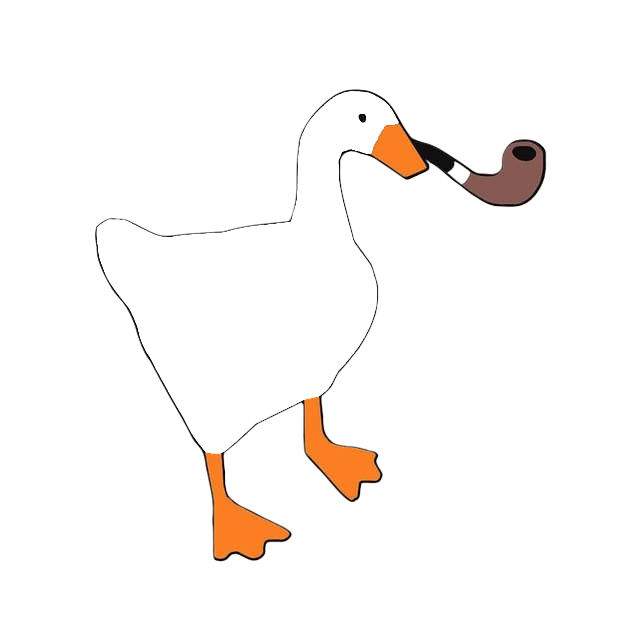

#  Auto-Hide HUD for Assetto Corsa
Allows you to auto-hide any app on your HUD with custom rules based on the interior/exterior view and selected desktop.

## Features
- Auto-hide all apps in interior or exterior view cameras.
- Auto-hide all apps in replays.
- Auto-hide virtual mirror (works even on servers with forced virtual mirror!).
- Auto-hide all apps if there's no mouse movement or D-Pad inputs for a set amount of seconds.
- Create custom rules to control each app window on your HUD individually.
- Choose which desktop you want the rule to work on.
- Save, edit, and delete your custom rules - everything is saved in the `rules.ini` config file.

## Video Demo

## Changelog
  - v1.3
    - Implemented timer based hiding for individual apps.
    - Updated the "auto-hide all" option to integrate the timer based hiding there instead of a separate toggle.
  - v1.2
    - Implemented auto-hiding of virtual mirror.
    - Added validation for manual inputs into time-out slider.
  - v1.1
    - Implemented auto-hiding of apps when there's no mouse movement or D-Pad inputs for x continuous seconds.
    - Implemented auto-hiding of all apps in replay mode.
    - Added option to recognize F6 int/ext cameras.
    - Fixed 'remove' button restoring apps on the wrong desktops.
  - v1.02
    - Fixed 'Hide all apps' option not working with apps that are also used in custom rules in certain conditions.
  - v1.01
    - Fixed apps not hiding when switcing from Dash camera to any of the F2-F7 cameras.

## Installation
1. Unpack the archive.
2. Copy the `Auto_Hide_HUD` into the `..\steamapps\common\assettocorsa\apps\lua` folder or just drag & drop the contents of the unpacked archive into your assettocorsa root.
3. In-game, open the `Auto Hide HUD` app, set up your rules, save, and enjoy! :)

## Uninstallation
Just delete the app's folder from `..\steamapps\common\assettocorsa\apps\lua`.
